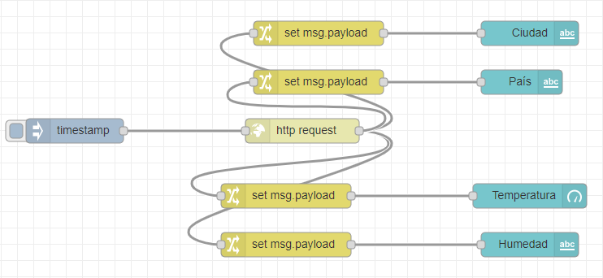
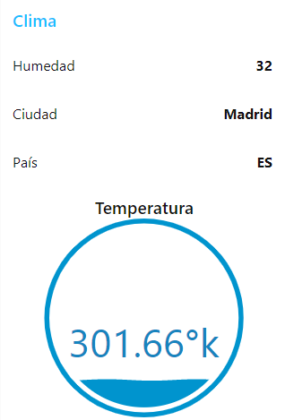

# Trabajo-de-investigacion_2

Trabajo de investigación-Segundo parcial

## Cloud computing con Node-Red

### 1. PLANTEAMIENTO DEL PROBLEMA

En el siguiente informe se dará a conocer las respuestas a las preguntas más recurrentes con respecto al la plataforma de FRED. Actualmente estamos sufriendo una transformación en la que los dispositivos se comunican con dispositivos, y dichas comunicaciones están creando nuevos modelos de negocio, productos y compañías. Aquí es donde aparece el concepto de Cloud Computing, ya que las PaaS funcionan sobre entornos Cloud. La Computación en la Nube se encuentra dentro de las Tecnologías Verdes, que hacen un uso eficiente de los recursos computacionales minimizando el impacto ambiental, maximizando su viabilidad económica, asegurando deberes sociales y promoviendo el reciclaje computacional. En los últimos años la información se ha convertido en uno de los recursos más valiosos para la economía y la vida cotidiana. Es por esto, que el poseerla es algo sumamente importante. Es necesario, que este esté disponible en cualquier momento o lugar de manera rápida, que sea fácil de compartir y que se pueda adaptar a nuestros requerimientos. Aquí se tratarán aspectos generales del tema, como la definición, tipos y características principales. Además, se presentarán ventajas y desventajas, de modo que cada quien pueda comprobar la eficiencia del Cloud Computing en la plataforma de FRED.

### 2. OBJETIVOS
#### Objetivo General

Conocer el funcionamiento del Cloud Computing en FRED utilizando Node-Red, identificando sus características principales para poder implementarlas en un ejemplo.

#### Objetivos Específicos 

•	Investigar el significado de Cloud Computing. 

•	Explicar: ¿En qué consiste el Cloud Computing?

•	Conocer las ventajas y desventajas de Cloud Computing en la plataforma de FRED.

•	Ejecutar un ejemplo elaborado en FRED que consulte el clima en un servicio remoto, así mismo explicar el funcionamiento de este.

### 3. ESTADO DEL ARTE

#### Node-RED 
También proporciona un navegador basado editor de flujo, nos permite interconectar dispositivos de hardware distintos y servicios en línea a través de una interfaz sencilla mediante soluciones software. Michael Blackstock y Rodger Lea en su artículo llamado “Hacia una plataforma de flujo de datos distribuidos para la web de Cosas (nodo distribuido-RED)” en el año 2014, nos menciona que muchos escenarios comunes de IoT en áreas como el hogar y la industria, automatización, inteligencia empresarial en tiempo real y espacios interactivos requieren integración con servicios en línea y (casi) en tiempo real detección y actuación. Si bien es posible crear en tiempo real aplicaciones interactivas de IoT que usan herramientas de programación tradicionales, puede ser difícil, requerir que los desarrolladores aprendan nuevos protocolos. [5]

Si bien las plataformas de flujo de datos han demostrado ser útiles por sí mismas, muchos de los escenarios de IoT requieren la coordinación de los recursos informáticos. alojado en cosas y servidores a través de Internet alojado en la nube, puertas de enlace y en el borde en dispositivos inteligentes. Dispositivos con los sensores conectados pueden cambiar las lecturas de sensores sin procesar para enviar eventos de "presencia" por ejemplo. Las puertas de enlace pueden agregar datos desde varios sensores y realizar un procesamiento de datos simple, los sistemas basados en la nube pueden conectarse a servicios en línea en tiempo real acceso a canales de redes sociales y alertas como el correo electrónico y SMS.
Creemos que al proporcionar un flujo de datos distribuido tiempo de ejecución para el IoT donde los flujos de datos se pueden alojar en una variedad de las plataformas, los desarrolladores pueden utilizarlas más fácilmente recursos informáticos en toda la red [5]. El objetivo de esta investigación es de conectar un flujo de datos enviados hacia una distinta plataforma utilizando Node-Red, es de gran utilidad para nuestra investigación. Node- RED además nos da la posibilidad de generar nuevos nodos en función de nuestras necesidades.

#### FRED Cloud

La información es enviada al servicio en la nube de FRED y el mismo se puede almacenar en base de datos local (MongoDB). Esta información puede ser recuperado de la base de datos en el momento del requerimiento, es decir para uso futuro. “Un concepto de IoT para humanos basados en la región Detección utilizando sensores PIR y FRED Cloud”, este artículo escrito por Naba Krushna Sabat, Santos Kumar Das, Biswa Ranjan Senapati, Umesh Chandra Pati escrito en el año 2019, con el objetivo de mejorar la vigilancia utilizando sensores de proximidad y los datos obtenidos enviarlos por cloud FRED y el mismo se puede almacenar en base de datos local (MongoDB). La seguridad y la vigilancia son un factor importante jugando en el escenario actual. Para que diferentes tipos de Se proponen técnicas. El sensor PIR es un detective de movimiento sensor también utilizado para detectar y alertar la presencia de objetos en una región particular cubierta por la zona del sensor llamado campo de visión (FoV). En otras palabras, se puede decir que proporciona seguridad y vigilancia de esa zona [6].

Internet of Thing (IoT) también tiene un factor de influencia en vida cotidiana, es una tecnología de rápido crecimiento donde todas las cosas están conectadas a una red y comunicación hecho entre cosas. FRED nos proporciona una plataforma de amplio rango donde los datos pueden almacenar y publicar tanto en público como en privado. Los la información también se almacena localmente en MongoDBbase de datos. Aquí lo hacemos público para que todos puedan acceder a la información. Una vez que se privatiza solo se autentica persona puede acceder al servicio en la nube. Node-red es una herramienta visual desarrollada por IBM Technology y se utiliza para cablear el IOT. Aquí las entradas, salidas y controladores son conectado y proporcionar flujo para procesar datos, conectarse cosas y envía información a la nube o envía un mensaje de alerta según sea necesario[6].

Nodo-red es usado para diseño de front-end con la ayuda de FRED (front-end para el nodo rojo), FRED gestiona instancias para el nodo rojo para múltiples usuarios en la nube. Este artículo es de gran utilidad ya que se relaciona bastante con nuestro tema de investigación, el uso de sensores cada vez se vuelve más común y el envío de datos debe hacerse de manera más rápida y sin cables, ya que dicha información debe llegar a lugares muy lejanos y así mismo debe ser entregada de manera muy rápida, he aquí la gran importancia del Cloud computing. La computación en nube será, con toda probabilidad, el motor de la computación del futuro.

### 4. MARCO TEÓRICO
#### Concepto de Cloud Computing

Hace muchos años ya se introdujeron conceptos de Cloud Computing esto por John McCarthy en 1960, quien dijo en un discurso que “Algún día la computación podrá ser organizada como un servicio público” y haciendo una comparación con lo ocurrido en la distribución eléctrica a comienzos del siglo XX donde las grandes empresas tenían su propio generador de energía, ahora las empresas grandes constan de sus servidores, clúster o supercomputadoras [1]

Según la IEEE Computer Society define al Cloud Computing como: “Un paradigma en el cual la información permanente es almacenada en servidores en Internet y colocada (“cache”) temporalmente en clientes que incluyen computadoras de escritorio, centros de entrenamiento, tablets, notebooks, laptops, y dispositivos portátiles, etc.” [1] y según el autor: La computación en nube es un modelo de procesamiento de información en el que las capacidades de computación administrados centralmente son entregados como servicios, en una función de las necesidades, a través de la red a una variedad de dispositivos de cara al usuario. [1]Cloud Computing es la evolución de un conjunto de tecnologías que afectan al enfoque de las organizaciones y empresas en la construcción de sus infraestructuras de TI. Al igual que ha sucedido con la evolución de la Web, con la Web 2.0 y la Web Semántica, la computación en nube no incorpora nuevas tecnologías. Se han unido tecnologías potentes e innovadoras, para construir este nuevo modelo y arquitectura de la Web. En las últimas décadas los procesos de deslocalización e internacionalización de las grandes empresas, unidos a la explosión en el uso la de tecnologías de información y procesamiento de datos, han hecho que las necesidades de cómputo de las grandes empresas y organizaciones hayan crecido a un ritmo superior al que lo hacía la capacidad de cálculo de los ordenadores personales. Por este motivo, y para satisfacer las necesidades de los sistemas de computación más exigentes, se ha producido una interesante evolución de las arquitecturas de cálculo, basada fundamentalmente en la ejecución simultánea de procesos en múltiples equipos informáticos. [2]

En otras palabras, la definición de cloud computing es ofrecer servicios a través de la conectividad y gran escala de Internet. La computación en la nube democratiza el acceso a recursos de software de nivel internacional, pues es una aplicación de software que atiende a diversos clientes. Eso proporciona a las empresas mayor flexibilidad en relación a sus datos e informaciones, que se pueden acceder en cualquier lugar y hora, siendo esencial para empresas con sedes alrededor del mundo o en distintos ambientes de trabajo. Con un mínimo de gestión, todos los elementos de software de la computación en la nube pueden ser dimensionados bajo demanda, solo se necesita conexión a Internet.

#### Internet of Things.

El término “Internet de las Cosas” (IoT) fue empleado por primera vez en 1999 por el pionero británico Kevin Ashton para describir un sistema en el cual los objetos del mundo físico se podían conectar a Internet por medio de sensores. En marzo de 2015, el Comité de Arquitectura de Internet (IAB) dio a conocer un documento para guiar la creación de redes de objetos inteligentes (RFC 7452),39 que describe un marco de cuatro modelos de comunicación comunes que utilizan los dispositivos de la IoT. En la discusión siguiente se presenta este marco y se explican las principales características de cada modelo. Las aplicaciones de IoT (Internet of Things) se han propagado de manera considerable en el sector industrial y su tecnología se ha utilizado durante décadas.

Una de las características comunes de IoT es que los objetos deben estar “instrumentados”, interconectados y ser procesados de manera inteligente en cualquier lugar, cualquier momento, de cualquier forma y cualquier modo. La mayoría de las aplicaciones verticales de internet de las cosas utilizan normalmente tecnologías del nivel de red y una plataforma middleware del nivel aplicación tales como redes cableadas o inalámbricas estándares, DBMS, frameworks de seguridad, webs basadas en middlewares de nivel 3, PaaS (platform as a service) multiusuario, interfaces SOA (service-oriented architecture), etc. [1]

El Internet de las cosas (IoT) se puede definir como una red altamente interconectada de entidades heterogéneas, tales como, etiquetas, sensores, dispositivos embebidos, dispositivos portátiles, etc., que interactúan y se comunican entre sí en tiempo real. IoT revolucionará la manera en que las personas y las organizaciones interactúan con el mundo físico, la interacción con dispositivos domésticos, automóviles, plantas industriales, etc., sufrirá grandes modificaciones. También permitirá que muchos servicios como salud, educación y gestión de recursos, puedan ser mejorados para comodidad del cliente. [3]

Las tecnologías que soportan IoT, son muy amplias y su evolución constante. Debido a la revolución de internet que ha llevado a la interconexión entre las personas en una escala sin precedentes. Acelerando de esta manera la revolución que será la interconexión de los objetos para crear un entorno inteligente. Solo en el 2011, 9 millones de dispositivos se encontraban interconectados a nivel mundial, generando como expectativa la interconexión de 24 mil millones de dispositivos en el 2020. [4]

### 5. DIAGRAMAS

### 6. MAPA DE VARIABLES

### 7. EXPLICACIÓN DEL CÓDIGO FUENTE

#### Observaciones
El servidor web nos proporciona la temperatura en grados kelvin, por lo que la temperarura de -273.15°k sera 0°c.
### 7.1 Ejemplo del Clima 
El siguiente ejemplo consiste en consultar el clima una determinada parte del mundo utilizando node-red en la plataforma FRED.
#### 7.1.1 Nodos utilizados
Los nodos utilizados en este ejemplo son los siguiente:

   •	Inject: Para empezar el programa

   •	Change: Solicitar un dato a la página web

   •	Http Request: Ingresar la página web que se va utilizar

   •	Text: Imprimir los resultados en otra página web.

#### 7.1.2 API HTTP de Administrador
Esta API basada en HTTP se puede utilizar para administrar de forma remota el tiempo de ejecución. Lo utiliza el editor Node-RED y la herramienta de administración de línea de comandos.
La API obtenidad de Open Weather que va ser lo que necesitamos para poder usar el servicio web. 

La clave API la ingresaremos en el nodo de “http request” en la parte de URL:

El siguiente nodo será Change:

Los nodos se comunican por medio de msg por lo cual es primordial poner eso al inicio de la petición más la petición que deseamos observar.

Por ultimo el nodo text servirá para imprimir los mensajes para clasificar la información:

En la parte de label ingresaremos la etiqueta o texto que deseamos, al unirlo con el nodo change se realiza la conexión entre ello para imprimirlos como uno solo.

#### 7.1.3 Reusltados
.

### 8. CONCLUSIONES
•	La herramienta de Node-RED puede ser utilizada para grandes proyectos pues da variedad de nodos que pueden ser utilizadas o adaptadas a nuestras necesidades incluyendo que te da la posibilidad de crear tus propios nodos y liberarlos para que otras personas los puedan utilizar.

•Se cumplió nuestro objetivos de nuestra investigacion se ha logrado el desplieguede de la informacion climatica en la nube de FRED como un servicion remoto.

•La mayoría de los avances tecnológicos necesarios para el desarrollo de IoT se han desarrollado de forma satisfactoria en esta plataforma, de tal manera que algunos fabricantes y entidades ya han empezado a implementar las IoT.

### 9. RECOMENDACIONES

### 10. CRONOGRAMA

### 11. BIBLIOGRAFÍA

### 12. ANEXOS
